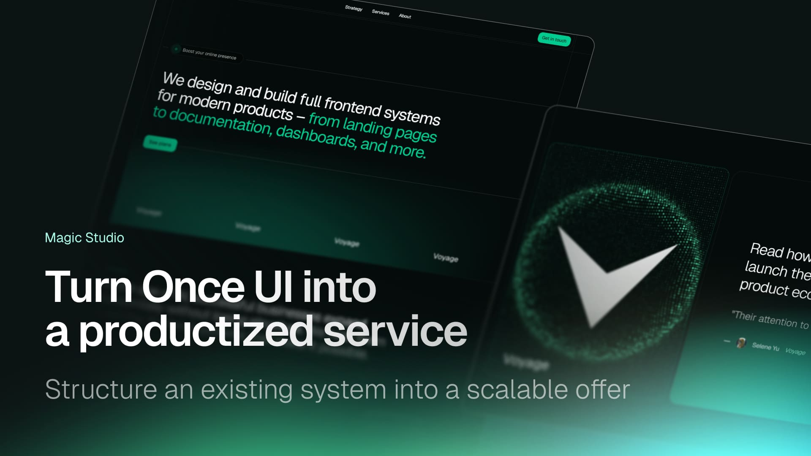

# Magic Studio

A ready-made template for launching your own productized service agency. Built on the Once UI ecosystem, Magic Studio helps you offer high-value frontend services to clients without building everything from scratch.

Perfect for designers, developers, and indie builders who want to turn their skills into a scalable service business.



## What's included

**Complete agency website**
- Hero section with clear value proposition
- Service showcase with modal details for each offering
- Testimonial section with case study modal
- Pricing bundles with interactive extras
- Process timeline
- FAQ section
- Fully responsive and SEO-optimized

**Pre-configured services**
- Landing page design & development
- Authentication & onboarding flows
- Dashboard interfaces
- Documentation systems
- Brand stores
- Launch strategy
- Community platforms

**Reusable components**
- `Showcase` - Portfolio grid with modal navigation
- `Testimonial` - Client testimonial with case study
- `Pricing` - Interactive pricing bundles
- `Process` - Visual process timeline
- `Hero` - Conversion-optimized hero section
- `Modal` - Portal-based modal with scroll management
- `ModalLink` - Navigation links that preserve scroll position

**Content management**
- MDX-based content for easy editing
- Structured content files in `/src/resources/content`
- Hot-reload support during development
- Type-safe content interfaces

## Quick start

1. **Clone and install**
```bash
git clone https://github.com/your-username/magic-agency.git
cd magic-agency
npm install
```

2. **Customize your content**
- Update `/src/resources/content/` files with your services
- Modify `/src/resources/seo.ts` with your agency details
- Replace images in `/public/images/`
- Adjust pricing in `/src/resources/content/plans.tsx`

3. **Run locally**
```bash
npm run dev
```

4. **Deploy**
```bash
npm run build
```

## Customization

All design tokens are managed in `/src/resources/once-ui.config.js`.

Customize:
- Brand colors
- Typography
- Border style

## Documentation

Learn more about Once UI at [docs.once-ui.com](https://docs.once-ui.com).

## Extend with Once UI products

**[Magic Portfolio](https://once-ui.com/products/magic-portfolio)** - Add a personal portfolio to showcase your own work

**[Magic Docs](https://once-ui.com/products/magic-docs)** - Create documentation for your services

**[Once UI Blocks](https://once-ui.com/blocks)** - Access 100+ pre-built components and sections

## Built with

- [Next.js](https://nextjs.org/) - React framework
- [Once UI](https://once-ui.com/) - Design system
- [TypeScript](https://www.typescriptlang.org/) - Type safety
- [MDX](https://mdxjs.com/) - Content management

## License

TL;DR: Access to Magic Studio under Once UI Pro and Once UI Indie plans allows personal / internal / commercial use, but prohibits SaaS, resale, redistribution, and public sharing of the source code.

See `LICENSE.txt` for more information.

## Created by

**Lorant One** - [lorant.one](https://lorant.one)

Part of the [Once UI](https://once-ui.com) ecosystem.