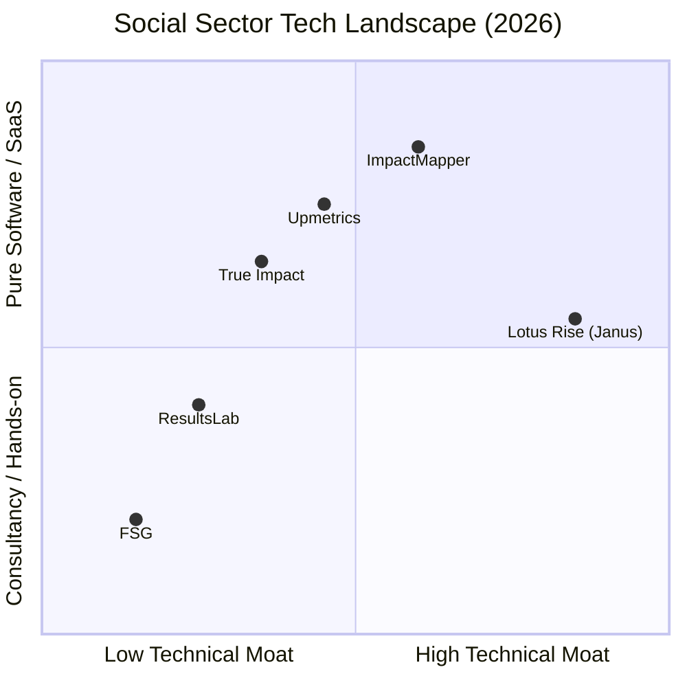

# Lotus Rise — Research & Competitor Landscape Analysis

**Owner:** Brand Strategy & Lead Researcher
**Last Updated:** June 2026
**Status:** Canonical Reference (Stewardship Tier)

---

## 1. Billion-Dollar Foundation Benchmarks

To design a platform that appeals to enterprise philanthropists, family offices, and leading nonprofits, we must analyze the visual and structural communication of the world's most influential foundations. We reject the crowded, noisy layouts of standard SaaS products and instead adopt the clean, editorial authority of these multi-billion-dollar institutions.

### 1.1 The Ford Foundation (Dignified Restraint)

The Ford Foundation's brand identity, designed by Hyperakt, is the gold standard for institutional trust. 

*   **Visual Strategy:** 
    *   **Ceding the Spotlight:** The branding is deliberately quiet. It uses a sturdily engineered, condensed serif logotype that steps back to allow the vibrant photography and stories of grantees to occupy the center of the page.
    *   **Palette:** Drawn from nature (warm earth tones, moss greens, deep clays) paired with neutrals inspired by classical journalism. Every color combination is selected for strict AA/AAA contrast compliance, ensuring universal access.
    *   **Typography:** Meursault (a custom, high-character display serif designed for newspaper headlines) paired with Domaine Text (an elegant, contemporary body serif) and Good Sans (a mid-century neo-grotesque sans-serif for subheads).
*   **Lotus Rise Application:**
    *   Establish a "Grantees-First" layout. The homepage should elevate the success of the nonprofits and foundations we support (e.g., John Templeton Foundation) rather than merely showing off software screenshots.
    *   Adopt an editorial typographic hierarchy (serif headers, highly legible sans-serif sub-labels).

### 1.2 The Bill & Melinda Gates Foundation (Modular Trust)

With over $50B in assets, the Gates Foundation focuses on systemic, data-driven interventions. Its digital presence is highly structured, quantitative, and optimistic.

*   **Visual Strategy:**
    *   **Modular "Gates":** The visual identity utilizes segments of its monogram as framing devices. These frames expand and contract to house statistics, testimonials, video clips, and research data.
    *   **Borders & Grids:** A heavy reliance on clean, 1px solid borders (`#767676`) and container-text max widths (`900px` with 3% padding) to maintain reading rhythm and structural discipline across screens.
    *   **Typography:** Strict typesetting rules using the Noto family (Noto Serif and Noto Sans) to transition smoothly between expressive press releases and dry, policy-heavy reports.
*   **Lotus Rise Application:**
    *   We will use the **lotus motif** (10-15% opacity in cream/indigo) as a framing element to anchor data cards and testimonials.
    *   We will adopt strict grid alignments, 1px subtle divider lines, and consistent vertical spacing (Once UI tokens) to present complex product suites cleanly.

### 1.3 The Chan Zuckerberg Initiative (CZI) (The Human Chorus)

CZI represents the modern, tech-forward wave of philanthropy, blending scientific research, technology, and community-driven advocacy.

*   **Visual Strategy:**
    *   **Human-Centered Energy:** Avoids cold, traditional institutional barriers. It uses active, warm photography, bold serif statements, and a "chorus of voices" approach, highlighting human operators in the field.
    *   **Tech-Forward Optimism:** Highly modern but accessible. Uses subtle, organic motion curves and generous whitespace to convey agility and speed without feeling sterile.
*   **Lotus Rise Application:**
    *   Humanize our positioning. We highlight that our tools are "created by social sector veterans in collaboration with software engineers."
    *   We emphasize the **XESO-powered GuidePath AI Coach** not as a generic chatbot, but as an empathetic co-pilot ("Coach") that understands the heavy cognitive load of program officers.

---

## 2. Social-Tech Competitor Analysis

We analyze our direct software-as-a-service and consulting competitors to capture best practices and identify strategic gaps we can exploit.

### 2.1 Upmetrics (upmetrics.com)
*   **What they do:** Provide an impact reporting system alongside limited consulting services.
*   **What to steal:** Their pricing page structure. They group pricing into clear, accessible tiers. They utilize clean, modern, bookmark-shaped cards with clear benefit lists.
*   **What to refuse:** Their overly SaaS-heavy, transaction-oriented landing pages. They use standard "sales funnel" layouts that feel too corporate and commercial for long-term philanthropic partnerships.

### 2.2 True Impact (trueimpact.com)
*   **What they do:** Offer an impact measurement web app designed to quantify the social return on investment (SROI) for grants.
*   **What to steal:** Their use-case framing. They speak directly and distinctively to individual sectors: foundations, corporate donors, and nonprofits.
*   **What to refuse:** Outdated UI/UX. Their visual presentation is rigid, heavy, and fails to inspire creative engagement.

### 2.3 ResultsLab (resultslab.com)
*   **What they do:** Position themselves as an impact tracking partner, leaning heavily on hands-on team consulting, coaching, and dashboard setups.
*   **What to steal:** Their client stories page. They connect qualitative grantee testimony with quantitative impact tracking beautifully.
*   **What to refuse:** Lack of a proprietary, highly automated technical moat. They operate primarily as a high-touch agency rather than a scalable software-enabled service.

### 2.4 ImpactMapper (impactmapper.com)
*   **What they do:** An evaluative tool focused on data analysis, qualitative narrative coding, and custom survey construction.
*   **What to steal:** Their equity-driven pricing model. They explicitly state that a portion of the subscription fees paid by larger foundations directly funds access and software licenses for smaller, under-resourced grassroots nonprofits. This aligns perfectly with Lotus Rise's identity as a Public Benefit Corporation (PBC).
*   **What to refuse:** Over-indexing on heavy, abstract research terminology that can overwhelm non-academic nonprofit managers.

### 2.5 FSG (fsg.org)
*   **What they do:** A world-renowned social impact consulting firm founded by Michael Porter and Mark Kramer.
*   **What to steal:** Their consulting methodology page. They walk through their "how we approach things" framework with deep intellectual authority.
*   **What to refuse:** Purely manual consultancy models. FSG has no scalable software suite or AI-driven tooling; we bridge their strategic depth with the automated leverage of the Janus suite.

---

## 3. Ideal Client Personas (ICP) & Tailored Value Propositions

Lotus Rise serves three distinct sectors within the social impact ecosystem. Our homepage must address their unique pain points within 5 seconds of landing.

### 3.1 Nonprofits (The Implementers)
*   **The Burden:** Overwhelmed by compliance, spending 20-30% of their time compiling custom reports for different funders, and operating out of disconnected spreadsheets with zero data governance.
*   **Our Value Proposition:** "One unified repository for all program logic, interviews, and outputs. Draft board-ready reports and scientific grant outputs in minutes, not weeks, with fully grounded AI verification."

### 3.2 Funders & Impact Investors (The Allocators)
*   **The Bias:** Grant decisions are historically driven by emotional narratives or rigid, non-comparable PDF applications, leading to unaligned funding and unprovable outcomes.
*   **Our Value Proposition:** "Standardize evaluation methodologies across your portfolio. Use the Proof envelope standard to audit claims and ground funding decisions in real evidence, mitigating allocation risk."

### 3.3 Capacity Support Organizations (The Enablers)
*   **The Scale Gap:** Local government agencies, regional consultancies, and technical assistance intermediaries want to elevate hundreds of grassroots organizations but lack the staff to coach them individually.
*   **Our Value Proposition:** "Deploy expert, preconfigured evaluation templates and custom coaching models at scale. White-label the Janus environment to serve as the region's centralized impact backbone."
